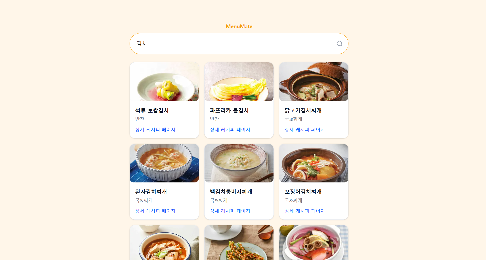
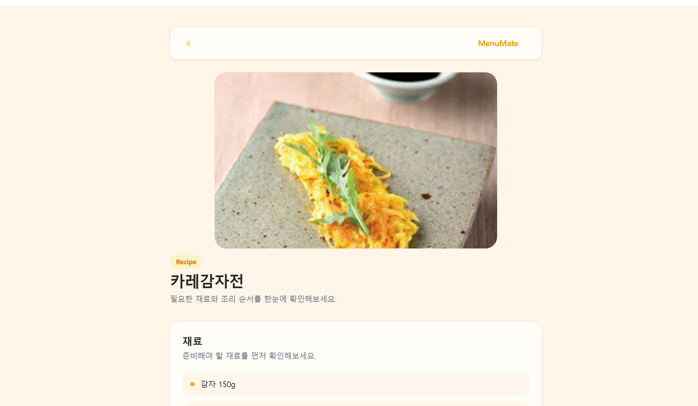

# MenuMate

> 🔍 메뉴 탐색부터 레시피 확인까지, 끊김 없는 경험을 제공하는 서비스

👉 배포링크 - https://menu-mate-puce.vercel.app

## 📌 목차

- [프로젝트 소개](#1-프로젝트-소개)
- [배포 링크](#2-배포-링크)
- [프로젝트 기간 및 진행 방식](#3-프로젝트-기간-및-진행-방식)
- [주요 기능](#4-주요-기능)
- [기술 스택](#5-기술-스택)
- [폴더 구조](#6-폴더-구조)
- [설치 및 실행 방법](#7-설치-및-실행-방법)
- [트러블슈팅](#8-트러블슈팅--기술적-고민)

## 1. 프로젝트 소개

MenuMate는 일상 속 메뉴를 결정하는 상황에서 사용자가 쉽게 음식 및 음식의 레시피를 탐색하고 선택할 수 있도록 돕는 웹 서비스입니다.

일상에서 "오늘 뭐 먹지?"라는 고민하는 경우가 자주 발생하지만, 원하는 메뉴를 떠올리거나 레시피를 찾는 과정은 번거로운 경우가 많습니다.

이러한 문제를 해결하기 위해 MenuMate는 음식 검색 기능과 상세 레시피 조회 기능을 제공하고, 검색 상태를 URL 기반으로 관리하여 페이지 이동 이후에도 자연스럽게 흐름이 이어지도록 구현했습니다.

이를 통해 사용자는 메뉴 탐색부터 레시피 확인까지의 과정을 자연스러운 흐름으로 경험할 수 있습니다.

## 2. 주요 화면

#### [검색화면]

#### [레시피 화면]

## 3. 프로젝트 기간 및 진행 방식

- 진행기간: 2026 .03 ~ 2026 .04
- 프로젝트 유형: 개인 프로젝트
  프론트엔드 개발자로서 단순 UI 구현을 넘어 실제 서비스 흐름을 설계하고, 사용자 경험을 개선하는 과정을 경험하기 위해 시작한 프로젝트입니다.

CI/CD 및 소스코드 관리, 검색 기능 구현, URL 기반 상태 관리, 외부 API 연동, 그리고 Vercel을 활용한 배포까지 전반적인 개발 사이클을 직접 수행했습니다.

또한 개발 환경과 프로덕션 환경 간의 동작 차이를 경험하며, 배포 이후 발생하는 문제를 해결하는 과정까지 포함하여 프로젝트를 진행했습니다.

## 4. 주요 기능

### 🔍 음식 검색 기능

사용자가 원하는 메뉴를 키워드로 검색하면 관련 레시피를 조회할 수 있습니다.  
검색은 submit 기반으로 동작하도록 설계하여 불필요한 API 호출을 줄이고, 사용자 의도에 맞는 결과를 제공합니다.

---

### 📄 레시피 상세 조회

검색 결과에서 선택한 메뉴의 상세 레시피를 확인할 수 있습니다.  
재료 정보와 조리 과정을 단계별로 제공해 사용자가 직관적으로 레시피를 이해할 수 있도록 구성했습니다.

---

### 🔗 URL 기반 검색 상태 유지

검색 결과에서 상세 페이지로 이동한 뒤 뒤로가기를 하더라도, 기존 검색 결과와 상태가 유지되도록 구현했습니다.  
이를 위해 URL Query Parameter(`?q=`)를 활용하여 상태를 관리하고, 사용자 흐름이 끊기지 않도록 개선했습니다.

---

### ⚡ 프로덕션 환경 기준 QA 및 안정성 개선

`npm run start` 기반의 프로덕션 환경에서 테스트를 진행하며, 개발 환경에서는 발견되지 않던 문제를 확인하고 수정했습니다.  
이를 통해 실제 배포 환경에서도 안정적으로 동작할 수 있도록 개선했습니다.

---

### 🌐 외부 API 연동

식약처의 조리식품의 레시피 DB의 API를 활용하여 실제 데이터를 기반으로 서비스를 구성했습니다.  
외부 API의 응답 구조를 분석하고, 필요한 데이터만 가공하여 UI에 맞게 재구성했습니다.

## 5. 기술 스택

> 사용자 경험 개선과 안정적인 데이터 처리를 중심으로 기술을 선택했습니다.

### Frontend

- **Next.js (App Router)**
  - 파일 기반 라우팅과 서버 컴포넌트와 클라이언트 컴포넌트를 혼합하며 활용해서 페이지 구조를 구성했습니다.
  - 특히 검색 결과와 상세 페이지 간의 흐름을 자연스럽게 연결하고, 서버에서 데이터를 처리하는 구조를 경험하기 위해 선택했습니다.

- **TypeScript**
  - API 응답 데이터 구조를 명확히 정의하고, 타입 안정성을 확보하기 위해 사용했습니다.
  - 외부 API 데이터를 다루는 과정에서 발생할 수 있는 오류를 사전에 방지하는 데 도움이 되었습니다.

- **Tailwind CSS**
  - 빠른 UI 구현과 일관된 스타일링을 위해 사용했습니다.
  - 유틸리티 클래스 기반으로 반복적인 스타일 정의를 줄이고, 유지보수성을 높일 수 있었습니다.

---

### State & Data Fetching

- **URL 기반 상태 관리**
  - 검색 상태를 URL Query Parameter(`?q=`)로 관리하여 페이지 이동 및 새로고침 시에도 상태가 유지되도록 구현했습니다.
  - 이를 통해 사용자 경험이 끊기지 않도록 개선했습니다.

- **TanStack Query**
  - 서버 상태를 캐싱 기반으로 관리하여 API 호출을 최적화했습니다.
  - 뒤로가기 및 재진입 시에도 데이터를 빠르게 복원할 수 있도록 개선했습니다.

---

### API

- **식약처 레시피 Open API**
  - 실제 데이터를 기반으로 서비스를 구성하기 위해 공공 API를 활용했습니다.
  - API 응답 구조를 분석하고 필요한 데이터만 가공하여 UI에 맞게 재구성했습니다.

---

### Version Control

- **Git & GitHub**
  - 브랜치 전략을 기반으로 기능 단위 개발을 진행하고, Pull Request를 통해 변경 사항을 관리했습니다.
  - CI를 통해 lint, type check, build 과정을 자동화하여 코드 품질을 유지했습니다.

  ***

### Deployment

- **Vercel**
  - Next.js와의 높은 호환성과 간편한 배포 환경을 고려하여 선택했습니다.
  - GitHub 연동을 통해 자동 배포(CD)를 구성하고, 프로덕션 환경에서의 동작을 검증했습니다.

## 6. 폴더 구조

기능 단위(feature)로 모듈을 분리하고, 각 모듈 내부를 api / lib / model / ui 계층으로 나누어 유지보수성과 확장성을 고려한 구조로 설계했습니다.

src
├── app # Next.js App Router (페이지 및 라우팅)
│ ├── api # 서버 API 라우트
│ │ ├── search
│ │ └── recipes
│ ├── recipes
│ │ └── [id] # 레시피 상세 페이지
│ └── page.tsx # 메인 페이지
│
├── features # 도메인 기반 기능 모듈
│ ├── search # 검색 기능
│ │ ├── api # 검색 API 호출
│ │ ├── lib # 데이터 가공 로직
│ │ ├── model # 타입 정의
│ │ └── ui # 검색 관련 UI
│ │
│ └── recipes # 레시피 기능
│ ├── api
│ ├── lib
│ ├── model
│ └── ui
│
├── shared # 공통 모듈
│ ├── api # 공통 API 유틸
│ ├── lib # 유틸 함수
│ ├── types # 공통 타입
│ └── ui # 공용 UI 컴포넌트
│
└── styles # 글로벌 스타일

## 7. 설치 및 실행 방법

vs code 기준 설치 및 실행 방법입니다.

### 1. 저장소 클론

git clone https://github.com/kimin0401/MenuMate.git
cd MenuMate

### 2. 패키지 설치

npm install

### 3. 환경 변수 설정

식약처의 조리식품의 레시피 DB의 API키를 요청해서 받아 사용합니다.

- 예시: FOOD_API_KEY=your_api_key

### 4. 개발 서버 실행

npm run dev
localhost:3000에서 확인할 수 있습니다.

## 8. 트러블슈팅 / 기술적 고민

### 🔍 검색 로직 리팩토링 (상태 관리 → 캐시 관리)

#### 문제 상황

초기에는 검색 결과를 React state로 관리했기 때문에, 페이지 이동이나 새로고침 시 데이터가 유지되지 않고 UX가 끊기는 문제가 있었습니다.

#### 원인 분석

검색 결과를 클라이언트 상태로만 관리하면서 서버 데이터와의 동기화가 어렵고, 불필요한 API 호출이 반복되는 구조였습니다.

#### 해결 방법

TanStack Query를 도입하여 서버 상태를 캐싱 기반으로 관리하도록 리팩토링했습니다.  
이를 통해 동일한 요청에 대해 캐시된 데이터를 활용하고, 상태 관리 로직을 단순화했습니다.

#### 결과

- 불필요한 API 호출 감소
- 뒤로가기 및 재진입 시 빠른 데이터 복원
- 서버 상태 관리 구조 개선

자세한 내용은 블로그 글에서 확인할 수 있습니다.

[검색 로직 리팩토링] (https://dev-in96.tistory.com/83)
[리팩토링 이후 Recoverable Error해결] (https://dev-in96.tistory.com/84)

---

### ⚡ 검색 API 500 에러 해결 (Debounce 적용)

#### 문제 상황

검색 입력 시마다 API 요청이 발생하면서, 짧은 시간 내에 과도한 요청이 발생하여 500 에러가 발생했습니다.

#### 원인 분석

사용자 입력 변화마다 즉시 API 요청을 보내는 구조로 인해 서버 부하가 증가하고, 외부 API 응답이 불안정해졌습니다.

#### 해결 방법

Debounce를 적용하여 일정 시간 동안 입력이 멈춘 경우에만 API 요청이 발생하도록 개선했습니다.

#### 결과

- API 요청 횟수 감소
- 500 에러 발생 빈도 감소
- 사용자 입력 경험 개선

자세한 내용은 블로그 글에서 확인할 수 있습니다.

[검색 API 500 에러 해결] (https://dev-in96.tistory.com/80)

---

### 🧩 App Router 구조 오해로 인한 Build 오류 해결

#### 문제 상황

Next.js App Router 환경에서 페이지와 API 라우트를 동일 경로에 구성하면서 build 시 충돌 오류가 발생했습니다.

#### 원인 분석

App Router에서는 `page.tsx`와 `route.ts`가 동일 경로에 존재할 경우 충돌이 발생하는 구조였음을 인지하지 못했습니다.

#### 해결 방법

API 라우트를 `/api` 경로로 분리하여 페이지 라우팅과 명확히 구분하도록 구조를 수정했습니다.

#### 결과

- build 오류 해결
- 라우팅 구조 명확화
- App Router 구조에 대한 이해도 향상

자세한 내용은 블로그 글에서 확인할 수 있습니다.

[App Router 구조 오해로 인한 Build 오류 해결] (https://dev-in96.tistory.com/72)
